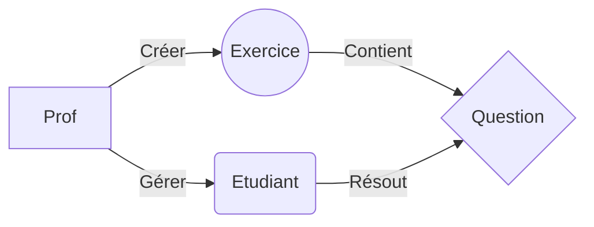

# Projet LiveMoodle

Dans le cadre d'un projet professionnel on doit réaliser une application web semblable à Moodle avec un aspect Live. 
/////

# Fichiers
à faire
# Commandes

	git clone https://gitlab-mmi.univ-reims.fr/hami0010/livemoodle
	composer install
	copier le contenu de env.example dans env (et specifier une base de donnée vide)
	php artisan key:generate
	php artisan migrate
	php artisan DB:seed (permet la population de la bdd pour faciliter les test)
    composer require barryvdh/laravel-debugbar --dev
	vous pouvez vous connecter à l'application web en créant un compte ou bien en utilisant le
	compte pré difini prof@prof.com - password / etudiant@etudiant.com - password (accès limité)
	localhost/phpmyadmin user: root - mdp :(vide)
	

## Diagramme (test)

